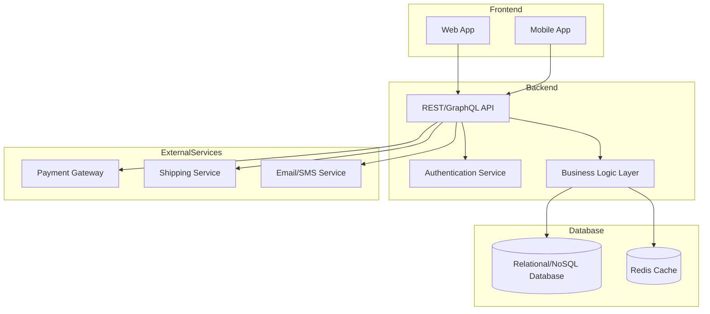

# Kiến trúc tổng thể hệ thống bán hàng đa nền tảng

---

## 1. Frontend (Web + Mobile)

### **Web App**

* Dùng React/Vue/Angular.
* Cho phép khách hàng duyệt sản phẩm, giỏ hàng, thanh toán.

### **Mobile App**

* Có thể phát triển bằng Flutter/React Native.
* Tập trung trải nghiệm người dùng trên thiết bị di động.

---

## 2. Backend

### **API Layer**

* Cung cấp endpoint REST/GraphQL.
* Nhận request từ Web/Mobile và trả về dữ liệu.

### **Authentication Service**

* Quản lý đăng nhập, đăng ký, JWT, phân quyền.

### **Business Logic Layer**

* Xử lý nghiệp vụ: quản lý sản phẩm, giỏ hàng, đơn hàng, thanh toán.

---

## 3. Database

### **Database chính**

* Lưu trữ thông tin người dùng, sản phẩm, đơn hàng.
* Sử dụng RDBMS (MySQL/PostgreSQL) hoặc NoSQL (MongoDB).

### **Cache (Redis)**

* Tăng tốc độ truy vấn dữ liệu nóng: sản phẩm, phiên đăng nhập.

---

## 4. External Services

### **Payment Gateway**

* Tích hợp VNPay, MoMo, PayPal… để thanh toán trực tuyến.

### **Shipping Service**

* Tích hợp giao hàng: Giao Hàng Nhanh, Viettel Post.

### **Email/SMS Service**

* Gửi thông báo đơn hàng, OTP.

---

Nếu bạn muốn chi tiết từng module hoặc mở rộng sang microservices, mình có thể bổ sung.
